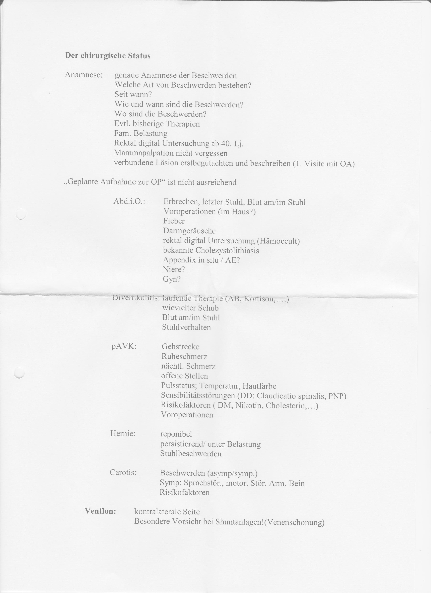

Der chirurgische Status Anamnese: genaue Anamnese der Beschwerden Welche Art von Beschwerden bestehen?
Seit wann?
Wie und wann sind die Beschwerden?
Wo sind die Beschwerden?
Evtl. bisherige Therapien Fam. Belastung Rektal digital Untersuchung ab 40. Lj.
Mammapalpation nicht vergessen verbundene Läsion erstbegutachten und beschreiben (1. Visite mit OA)

„Geplante Aufnahme zur OP“ ist nicht ausreichend

## Abdomen in Observanz

Erbrechen, letzter Stuhl, Blut am/im Stuhl Voroperationen (im Haus?)
Fieber Darmgeräusche rektal digital Untersuchung (Hämoccult)
bekannte Cholezystolithiasis Appendix in situ/ AE?
Niere?
Gyn?
”` "W ' D DiVerfil<uliti'sTciau'fcl'2d«; Therapie (AB, Kortison,. . ..)
wievielter Schub Blut am/im Stuhl Stuhlverhalten pAVK: Gehstrecke Ruheschmerz nächtl. Schmerz offene Stellen Pulsstatus; Temperatur, Hautfarbe Sensibilitätsstörungen (DD: Claudicatio spinalis, PNP)
Risikofaktoren ( DM, Nikotin, Cholesterin ,... )
Voroperationen Hernie: reponibel persistierend/ unter Belastung Stuhlbeschwerden Carotis: Beschwerden (asymp/symp.)
Symp: Sprachstör., motor. Stör. Ann, Bein Risikofaktoren Venflon: kontralaterale Seite Besondere Vorsicht bei Shuntanlagen!(Venenschonung)

