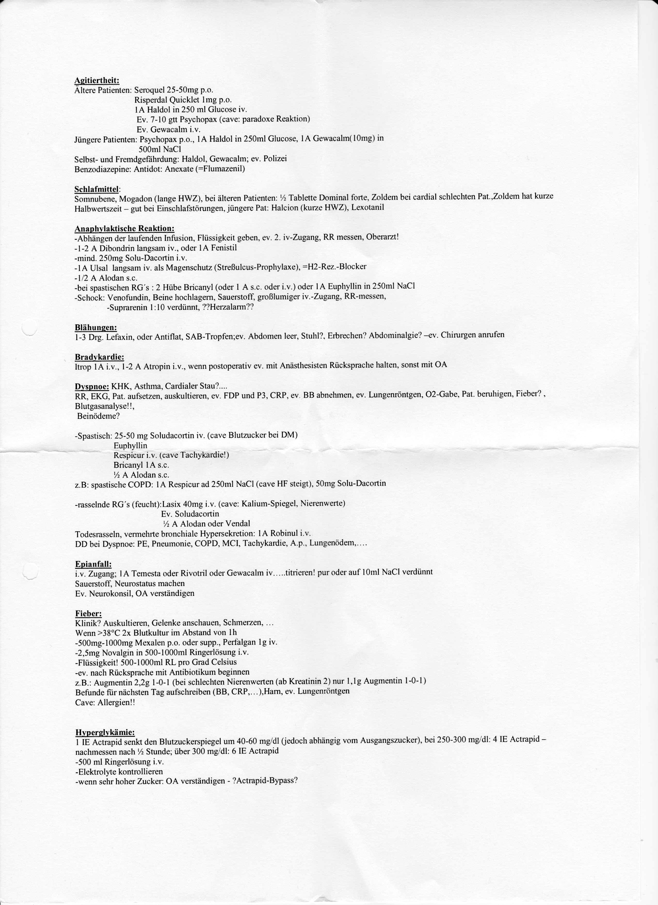
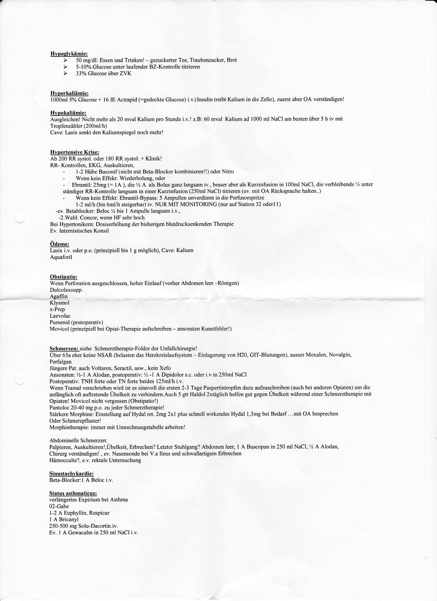

V 1 Agitiertheít:
Altere Patienten: Seroquel 25-50ıng po.
Risperdal Quicklet Iıng p.o.
IA Haldol in 250 ml Glucose iv.
Ev. 7-I0 gtt Psychopax (cave: paradoxe Reaktion)
Ev. Gewacalm i.v.
.lüngere Patienten: Psychopax p.o., IA Haldol in 250ml Glucose, IA GewacaIm( l0mg) in 500ml NaCl Selbst- und FreıncIgel`áhrdung: Haldol, Gewacalm; ev. Polizei Benzodiazepine: Antidot: Anexate (=FIumazenil)
Sclılafmittelz Somnubene, Mogadon (lange HWZ), bei älteren Patienten: I6 Tablette Domina] forte, Zoldem bei cardial schlechten Pat„Zoldem hat kurze Halbwertszeit - gut bei Einschlatstöıımgen,jüngere Pat: Halcion (kurze HWZ), Lexotanil Aııaghvlaktischc Reaktion:
-Abhängen der laufenden Infusion, Flüssigkeit geben, ev. 2. iv-Zugang, RR ınessen, Oberarzt!
-l-2 A Dibondrin Iangsaın iv., oder IA Fenistil -rnind. 250mg Solu-Dacoıtin i.v.
-IA Ulsal Iangsaın iv. als Magenschutz (Streßulcus-Prophylaxe), =H2-Rex.-Blocker -I/2 A Alodan s.c.
-bei spastischen RG's 2 2 Hübe Bricanyl (oder I A s.c. oder i.v.) oder IA Euphyllin in 250ınl NaCl -Schock: Venofundin, Beine hochlagem, Sauerstoff, großlumiger iv.-Zugang, RR-messen, -Suprarenin 1:10 verdünnt, '??Hei'zalaım'?'7 Blähungen:
I-3 Drg. Lefaxin, oder Antitlat, SAB-Tropfen;ev. Abdomen leer, StuhI?, Erbrechen? Abdominalgie? -ev. Chirurgen anrufen Bradykardie:
Itrop IA i.v., I-2 A Atropin i.v., wenn postoperativ ev. mit Anästhesisten Rücksprache halten. sonst mit OA Dysgnoe: KHK, Asthma, Cardialer Stau? ....
RR, EKG, Pat. aufsetzen, auskultieren, ev. FDP und P3, CRP, ev BB abnehmen, ev. Lungenröntgen, O2-Gabe, Pat. beıuhigen, Fieber? _
Blutgasanalysel I, Beinödeme?
-Spastisclr: 25-50 mg Soludacortin iv. (cavc Blutzucker bei DM)
Euphyllin Respicur i.v. (cave Taclıykzırdiel)
Bıicanyl IA s.c.
% A Alodan s.c.
z.B: spastische COPD: IA Respicur ad 250ml NaCl (cave HF steigt), 50mg Solu-Dacortin -rasselnde RG's (feueht):Lasix 40mg i.v. (cave: Kalium-Spiegel, Nierenweıte)
Ev. Soludacortin % A Alodan oder Vendal Todesrasseln, verınelnte bronchiale I-lypersckretion: IA Robinul i.v.
DD bei Dyspnoe: PE, Pneumonie, COPD, MCI, Tachykarclie, A.p., Lungenödem ,_.. _
Egianfall:
i.v. Zugang; IA Temesta oder Rivotril oder Gewacalm iv .,_.. titrieren! pur oder auf l0ınI NaCl verdünnt Sauerstol`l`, Neurostatus machen Ev. Neurokonsíl, OA verständigen Fieber:
Klinik? Auskulticren, Gelenke anschauen, Schmelzen,  
Wenn >38°C 2x Blutkultur im Abstand von Ih -500ıng-I000ıng Mexalen p.o. oder supp., Pertalgan lg iv.
-2,5mg Novalgin in 500-I0O0ınl Ringerlösung i.v.
-Flüssigkeit! 500-I000ınI RL pro Grad Celsius -ev. nach Rückspıache rnit Antibiotikuın beginnen z.B.: Augmentin 2,2g I-0-I (bei schlechten Nierenweıten (ab Kreatinin 2) nur I,lg Augınentin I-O-I)
Befunde ñir nächsten Tag aufschreiben (BB, CRP ,... ),Harn, ev. Lungcnröntgen Cave: Allergien!!
Hygerglykämiez l IE Actrapid senkt den Blutzuckerspiegel um 40-60 mg/dl (jedoch abhängig vom Ausgangszucker), bei 250-300 ing/dl: 4 IE Actrapid -
nachmessen nach % Stunde; über 300 mg/dl: 6 IE Aetıapid -500 ınl Rjngerlösung i.v.
-Elektrolyte kontrollieren -wenn sehr hoher Zucker: OA verständigen - ?Actrapid-Bypass?

Hypoglvkämie:
> 50 ing/dl: Essen und Trinken! - gezuckeıter Tee, Tıaubenzucker, Brot F* 5-10% Glucose unter laufender BZ-Kontrolle titıieren > 33% Glucose über ZVK Hygerkaliämiez l000ınl 5% Glucose + ló IE Actıapid (=gedeckte Glucose) i.v,(lnsulin treibt Kalium in die Zelle), zuerst aber OA verständigen!
Hygokaliämiez Ausgleichen! Nicht ınelır als 20 ınval Kalium pro Stunde i.v.! z.B: 60 ınval Kaliuın ad 1000 ınl NaCl am besten über 5 h iv ınit Tropfenzäliler (200ınl/h)
Cave: Lasix senkt den Kaliuınspiegel noch mehr!
Hygertensive Krise:
Ab 200 RR systol. oder 180 RR systol. + Klinik!
RR- Kontrollen, EKG, Auskultieren, - l-2 Hübe Buconil`(nielıt mit Beta-Blocker kombinierenll) oder Nitro - Wenn kein Effekt: Wiederholung, oder - Ebtantil: 25ıng (= lA ), die % A als Bolus ganz langsaın iv., besser aber als Kuızinfiısion in l00ml NaCl, die verbleibende % unter ständiger RR-Kontrolle langsam in einer Kurzinfusion (250ml NaCl) titıieren (ev. mit OA Rücksprache lıalten..)
- Wenn kein Effekt: Ebıantil-Bypass: 5 Aınpullen unverdünnt in die Perfiısorspıitze l-2 ınl/h (bis óml/h steigerbar) iv. NUR MIT MONITORING (nur auf Station 32 oderl I)
-ev. Betablocker: Beloc % bis l Ampulle langsaın i.v., -2.Wahl: Coneor, wenn HF sehr hoch Bei Hypertonikem: Dosiserhöhung der bisherigen blutdıueksenkenden Therapie Ev. lnternistisches Konsil Ödeme:
Lasix i.v. oder p.o. (prinzipiell bis l g ınöglich), Cave: Kalium Aquaforil Obstipatio:
Wenn Perforation ausgeschlossen, hoher Einlauf (vorher Abdoınen leer -Röntgen)
Dulcolaxstıpp Agaffin Klysınol x-Prep Laevolae Pursenid (postopeıativ)
Movicol (pıinzipiell bei Opiat-Theıapie aufschreiben - ansonsten Kunsttehlerl)
Schmerzen: siehe Schmeıztheıapie-Folder der Unfallchirurgie!
Uber 65a eher keine NSAR (belasten das Heızkreislaufsysteın -~ Einlagerung von H20, GIT-Blutungen), ausser Mexalen, Novalgin, Perfal gan Jüngere Pat. auch Voltaren, Seıactil, usw., kein Xelb Ansonsten: %-l A Alodan, postoperativ: V2 -l A Dipidoloı' s.c. oder i.v in 250ınl NaCl Postopeıativ: TNH foıte oder TN forte beides l25ml/h i„v.
Wenn Tramal veıschıieben wird ist es sinnvoll die ersten 2-3 Tage Paspcıtintropfen dazu aulzuschreiben (aueh bei anderen Opiaten) uın die anfänglich ofi auñretende Übelkeit zu verhindern.Auch 5 gtt Haldol Zxtäglich helfen gut gegen Übelkeit während einer Sehıneıztherapie mit Opiaten! Movicol nicht vergessen (Obstipatiol)
Pantoloc 20-40 mg p,o. zu jeder Schmeıztheıapie!
Stärkere Morphine: Einstellung auf Hydal ret. 2mg 2xl plus schnell wirkendes Hydal l,3ıng bei Bedarf ...mit OA besprechen Oder Schmeızpflaster!
Moıphintherapie: immer ınit Uınrechnungstabelle arbeiten!
Abdominelle Schmerzen:
Palpieren, Auskultieren!,Übelkeit, Erbrechen? Letzter Stuhlgang? Abdomen leer, 1 A Buscopan in 250 ınl NaCl, % A Alodan, C hiıurg verständigen! , ev. Nasensonde bei V.a lleus und sehwallartigeııı Erbrechen Hämoeculte?, e.v. rektale Untersuchung Sinustachykardie:
Beta-Blockerzl A Beloc i.v.
Status asthmaticus:
verlängertes Expiıium bei Asthma 02-Gabe l-2 A Euphyllin_ Respicur l A Bıicanyl 250-500 mg Solu-Dacoıtin.iv.
Ev. l A Gewacalm in 250ml NaC li.v.
Lfi

